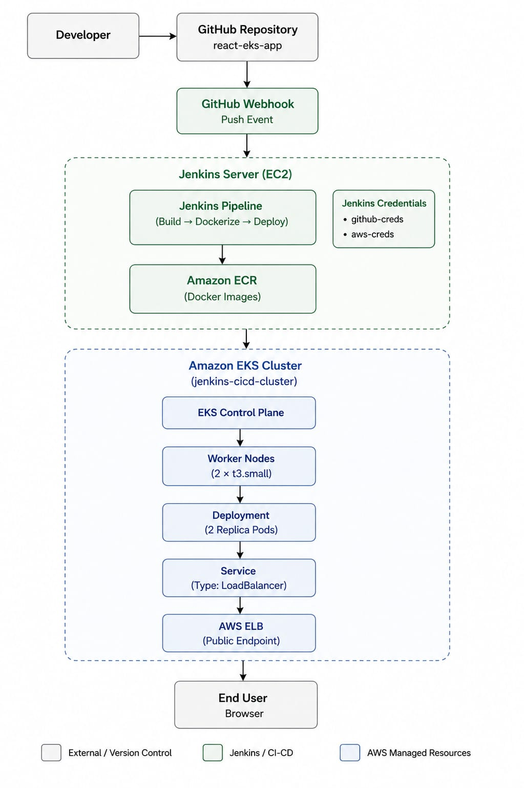
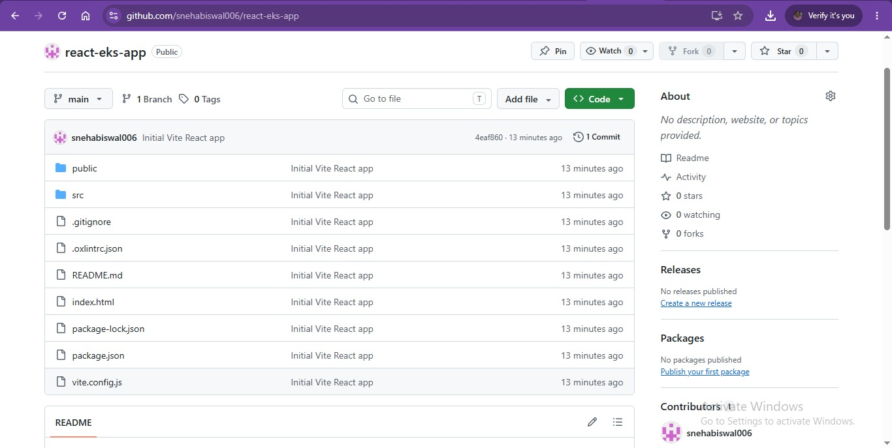
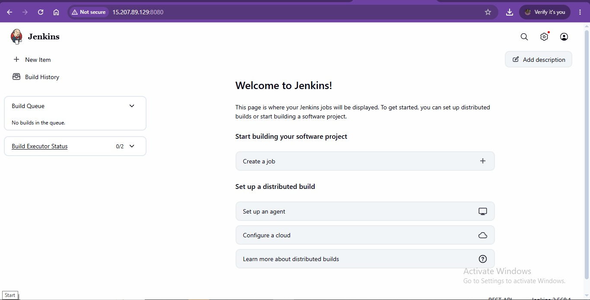
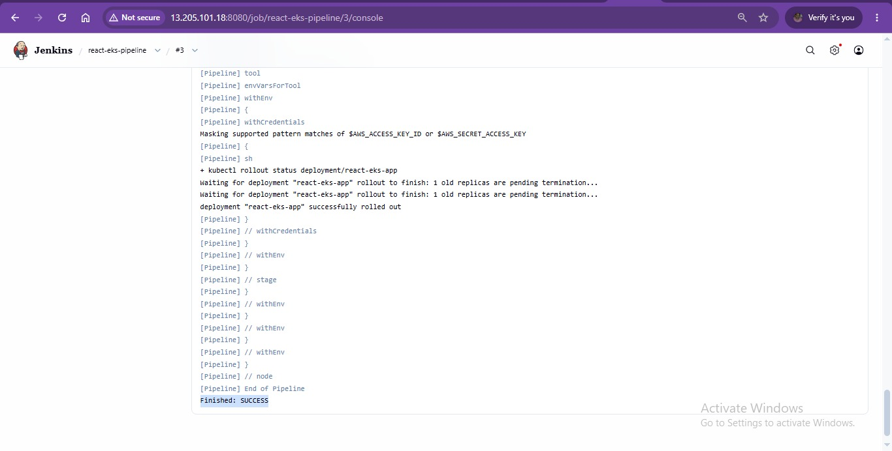
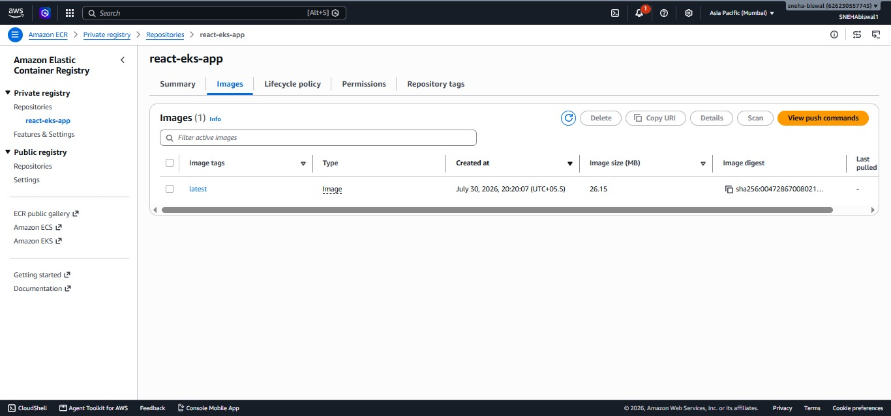
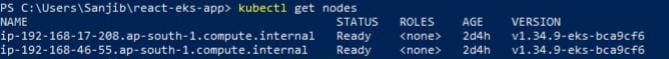
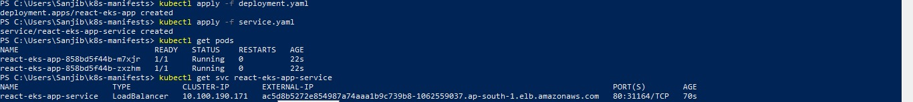
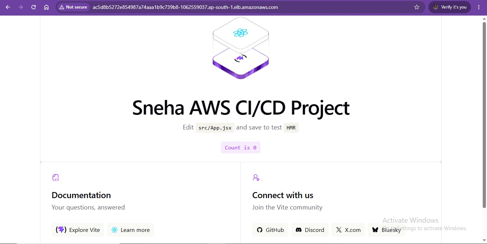

# AWS Jenkins CI/CD Pipeline with Amazon EKS

## Project Overview

This project demonstrates a complete CI/CD pipeline that automatically builds, containerizes, and deploys a React Vite application to Amazon EKS using Jenkins.

Jenkins, running on an Amazon EC2 instance, automates the entire workflow from source code retrieval to application deployment. Whenever code is pushed to GitHub, a GitHub Webhook triggers the Jenkins pipeline, which builds the application, creates a Docker image, pushes it to Amazon ECR, and updates the Kubernetes deployment running on Amazon EKS.

---

## Architecture

> Note: The architecture diagram contains the original repository name (react-eks-app) used during project development.



---

## Technologies Used

### AWS Services
- Amazon EC2
- Amazon EKS
- Amazon ECR
- AWS IAM
- AWS CLI
- Elastic Load Balancer (ELB)

### DevOps Tools
- Jenkins
- Docker
- Kubernetes
- kubectl
- GitHub
- GitHub Webhooks

### Application
- React
- Vite
- Node.js
---

## Project Workflow

1. Developer pushes code changes to GitHub.
2. GitHub Webhook automatically triggers Jenkins.
3. Jenkins checks out the latest source code.
4. Jenkins installs project dependencies.
5. Jenkins builds the React Vite application.
6. Jenkins creates a Docker image.
7. Jenkins pushes the Docker image to Amazon ECR.
8. Jenkins updates the existing Kubernetes Deployment on Amazon EKS with the new image.
9. Kubernetes performs a rolling update of application pods.
10. Jenkins verifies successful rollout completion.
11. The updated application remains accessible through the AWS LoadBalancer.

---

## Project Architecture Components

### GitHub Repository
Stores the React Vite application source code and Jenkinsfile.

### Jenkins Server (EC2)
Hosts Jenkins and executes the CI/CD pipeline.

### Amazon ECR
Stores Docker images generated by Jenkins.

### Amazon EKS
Runs the Kubernetes cluster hosting the application.

### Kubernetes Deployment
Maintains application replicas and handles rolling updates.

### LoadBalancer Service
Exposes the application to the internet through an AWS Elastic Load Balancer.

---
## Repository Structure

```
aws-jenkins-cicd-eks-project
│
├── Application
├── Architecture
├── Docker
├── Docs
├── Jenkins
├── Kubernetes
├── Screenshots
└── README.md
```

---

## Key Features

- Automated CI/CD pipeline
- GitHub webhook integration
- Docker containerization
- Amazon ECR image storage
- Kubernetes deployment on EKS
- LoadBalancer service exposure
- Automated application updates

---

## Screenshots

### GitHub Repository


### Jenkins Dashboard


### Successful Jenkins Pipeline


### Amazon ECR Repository


### EKS Worker Nodes


### Kubernetes Pods


### Kubernetes Service (LoadBalancer)


### Application Running on EKS


## Learning Outcomes

Through this project, I learned:

- Jenkins Pipeline Automation
- Docker Image Creation
- Amazon ECR Integration
- Kubernetes Deployments
- Amazon EKS Cluster Management
- GitHub Webhook Configuration
- CI/CD Best Practices

---

## Author

Sneha Biswal

B.Tech CSE Student  
Silicon Institute of Technology, Bhubaneswar
